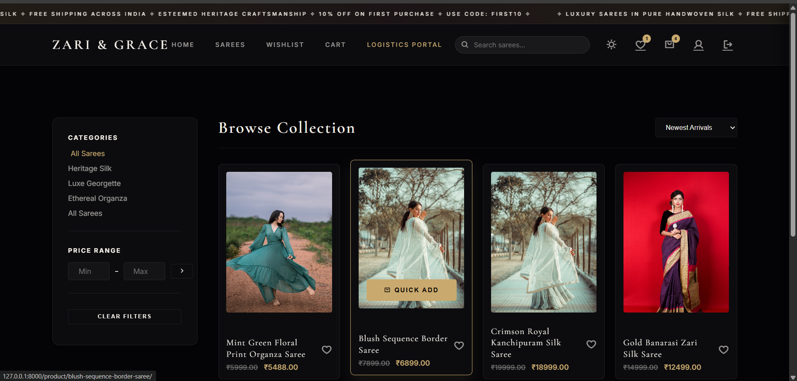
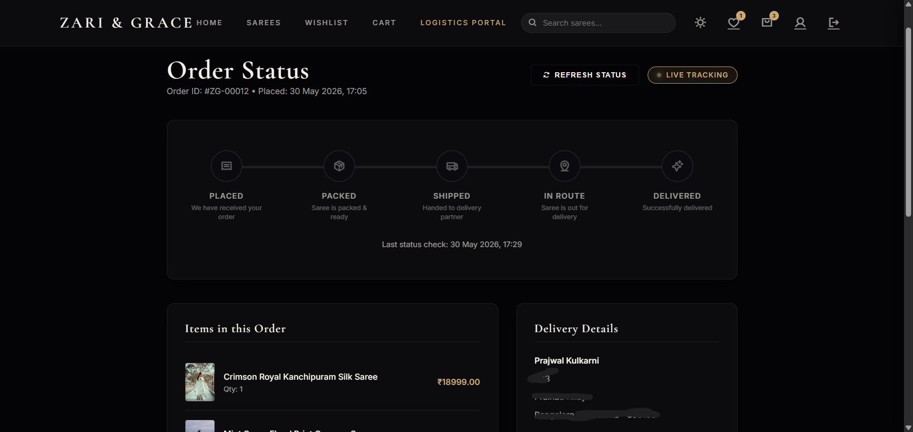
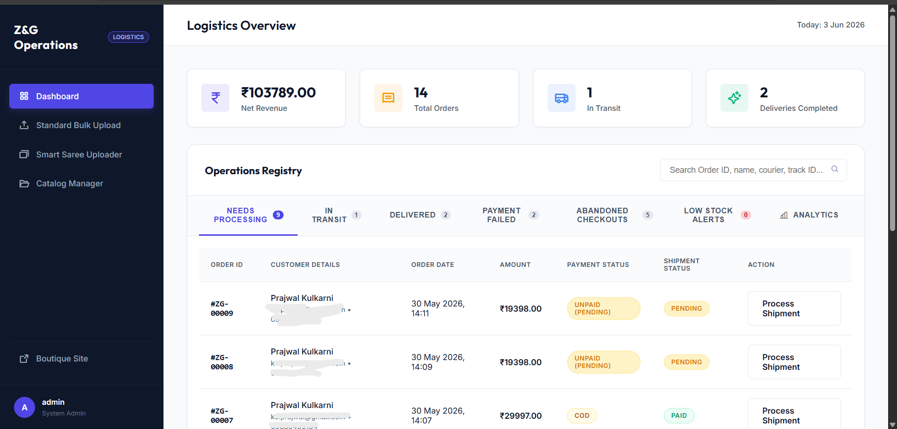
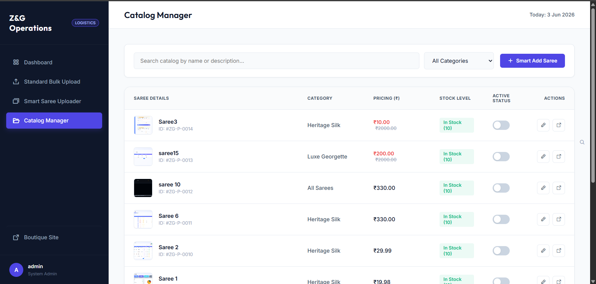
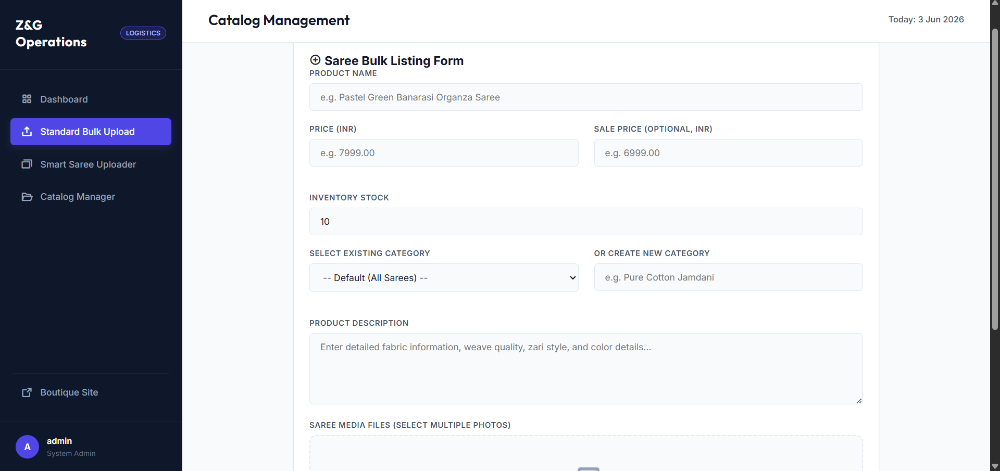
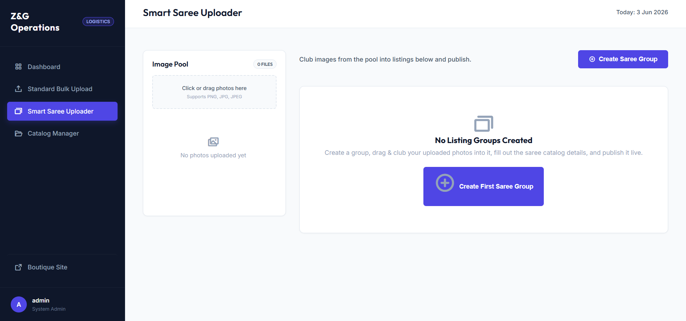

<div align="center">

# 🪡 Zari & Grace — Luxury Saree E-Commerce Platform

**Built for saree boutiques. Designed to sell.**

[](https://python.org)
[](https://djangoproject.com)
[](https://phonepe.com)
[](https://sqlite.org)
[]()

</div>

---

## What is this?

A full-stack e-commerce platform built from scratch for a **premium saree boutique** — **Zari & Grace**. Not a template. Not a theme. Every pixel is custom-built.

Customers get a luxury shopping experience. Store owners get a powerful logistics backend to manage orders, upload products, and track shipments — all in one place.

---

## Screenshots

### 🏠 Homepage — Divine Silk Hero
> Marquee announcement bar, hero banner with featured sarees, category explorer.


---

### 🧵 Shop By Category
> Browse Heritage Silk, Luxe Georgette, and Ethereal Organza collections.


---

### 🛍️ Browse Collection — Filter & Quick Add
> Category sidebar, price range filter, sort by newest/price, and a **Quick Add** hover action. No page reload needed.



---

### 🛒 Shopping Bag — Slide-Over Cart
> Full slide-over cart drawer with per-item quantity control, subtotal calculation, and one-click checkout.


---

### 💳 PhonePe Secure Pay
> Integrated PhonePe payment gateway — UPI QR Code or Credit/Debit Card. Real order reference, real amount.


---

### 📦 Order Tracking — Live Status
> Customer-facing order tracker with a 5-stage progress pipeline: Placed → Packed → Shipped → In Route → Delivered.



---

### 📊 Logistics Dashboard — Operations Center
> Owner-facing dashboard showing net revenue, total orders, shipments in transit, and completed deliveries. Full order registry with search, status tabs, and one-click shipment processing.



---

### 📋 Catalog Manager
> Browse, search, and manage the entire product catalog. Toggle active/inactive status per saree. Edit pricing, stock, and images inline.



---

### ⬆️ Standard Bulk Upload
> Add a new saree listing manually — name, price, sale price, stock, category (existing or new), description, and photos.



---

### ✨ Smart Saree Uploader
> Group-and-publish tool: drag photos into an image pool, club them into listing groups, fill details, and publish live — without navigating away.



---

## How It Works

```
Customer browses the boutique site (Zari & Grace)
        ↓
Adds sarees to cart (AJAX — no page refresh)
        ↓
Applies coupon code at checkout
        ↓
Redirected to PhonePe Secure Pay (UPI / Card)
        ↓
Payment confirmed → Order created → Email notification
        ↓
Customer tracks order via Order Status page (live pipeline)
        ↓
Owner logs into Logistics Portal
        ↓
Reviews order → Assigns courier → Updates shipment status
        ↓
Customer sees status update in real time
```

---

## Features

### 🛒 Storefront
| Feature | Details |
|---|---|
| **Hero Banner** | Full-bleed animated landing with saree carousel |
| **Category Browser** | Heritage Silk, Luxe Georgette, Ethereal Organza |
| **Product Listing** | Grid with Quick Add, wishlist toggle, price filters, sort |
| **Product Detail** | Multi-image gallery, description, reviews, add to cart |
| **AJAX Cart** | Slide-over drawer, quantity control, instant subtotal |
| **Wishlist** | Session/user-based, toggles without reload |
| **Search** | Autocomplete search bar across all sarees |
| **Coupon Codes** | Percentage or fixed discount, validity windows |
| **Checkout** | Full address form, delivery instructions, order summary |
| **Payment** | PhonePe gateway — UPI QR or Credit/Debit Card |
| **Order Tracking** | 5-stage pipeline tracker per order |
| **Reviews** | Star ratings + text reviews per product |
| **Dark/Light Mode** | Theme toggle in navbar |
| **Auth** | Register, Login, Profile, Logout |

### 🏭 Logistics Portal (Owner Dashboard)
| Feature | Details |
|---|---|
| **Revenue Dashboard** | Net revenue, total orders, in-transit, delivered count |
| **Order Registry** | Full order list with tabs: Needs Processing / In Transit / Delivered / Payment Failed / Abandoned Checkouts / Low Stock |
| **Order Detail** | Full order breakdown, customer info, invoice generation |
| **Shipment Control** | Assign courier, update status (Packed → Shipped → In Route → Delivered) |
| **Cart Recovery** | Send recovery email to customers with abandoned checkouts |
| **Catalog Manager** | Browse all products, toggle active/inactive, edit listings |
| **Standard Bulk Upload** | Add products with name, price, stock, category, photos |
| **Smart Saree Uploader** | Drag-drop image pool → group photos → publish as listing |
| **Product Edit** | Inline product editing with image management |
| **Analytics Tab** | Sales analytics inside the order dashboard |

---

## Tech Stack

| Layer | Technology |
|---|---|
| **Backend** | Python 3.11, Django 5.2 |
| **Database** | SQLite (swap to PostgreSQL for prod) |
| **Payment** | PhonePe PG API (UPI + Card) |
| **Frontend** | Vanilla HTML/CSS/JS — no framework, no bloat |
| **Image Handling** | Pillow — multi-image product uploads |
| **Auth** | Django built-in auth + session-based guest cart |
| **Deployment** | Any WSGI host (PythonAnywhere, Railway, etc.) |

---

## Project Structure

```
zariegrace/                  ← Django project config
├── settings.py              # PhonePe keys, DB, installed apps
├── urls.py                  # Root URL routing

store/                       ← Main e-commerce app
├── models.py                # Product, Cart, Order, Wishlist, Coupon, Review
├── views.py                 # All storefront + logistics views (AJAX-heavy)
├── urls.py                  # 40+ URL routes
├── admin.py                 # Django admin config
└── context_processors.py    # Cart/wishlist count injected globally

payments/                    ← PhonePe integration
├── phonepay.py              # PhonePe API: initiate, verify, callback
└── views.py                 # Payment initiation + callback handler

templates/
├── base.html                # Base layout — navbar, marquee, cart drawer
├── store/                   # Product, cart, checkout, tracking, auth pages
├── logistics/               # Dashboard, order detail, invoice, uploader
└── payments/                # Payment gateway page

static/
├── css/                     # Custom styles per page
└── js/                      # AJAX cart, wishlist, search, uploader logic

screenshots/                 # All UI screenshots
seed_database.py             # Seed script to populate demo products
```

---

## Setup

### 1. Clone & create virtual environment

```bash
git clone git@github.com:Prajwal-A-Kulkarni/Ecommerce-for-saree-sales-.git
cd Ecommerce-for-saree-sales-

python -m venv venv
# Windows:
venv\Scripts\activate
# Mac/Linux:
source venv/bin/activate
```

### 2. Install dependencies

```bash
pip install -r requirements.txt
```

### 3. Environment variables

Create a `.env` file or set these directly in `zariegrace/settings.py`:

```env
PHONEPE_MERCHANT_ID=your_merchant_id
PHONEPE_SALT_KEY=your_32char_salt_key
PHONEPE_SALT_INDEX=1
PHONEPE_BASE_URL=https://api-preprod.phonepe.com/apis/pg-sandbox
PHONEPE_REDIRECT_URL=http://localhost:8000/payments/callback/
PHONEPE_CALLBACK_URL=http://localhost:8000/payments/callback/
```

### 4. Migrate & seed

```bash
python manage.py makemigrations
python manage.py migrate
python manage.py createsuperuser
python seed_database.py   # Optional: populate demo sarees
```

### 5. Run

```bash
python manage.py runserver
```

Visit `http://localhost:8000` for the boutique.
Visit `http://localhost:8000/logistics/dashboard/` for the ops portal.

---

## URL Reference

| Method | Endpoint | Description |
|---|---|---|
| `GET` | `/` | Homepage / Hero |
| `GET` | `/products/` | Browse collection |
| `GET` | `/product/<slug>/` | Product detail page |
| `GET` | `/cart/` | Full cart page |
| `GET` | `/wishlist/` | Wishlist page |
| `GET` | `/checkout/` | Checkout form |
| `GET` | `/order/success/<id>/` | Order confirmation |
| `GET` | `/order/<id>/track/` | Customer order tracker |
| `GET` | `/logistics/dashboard/` | Logistics dashboard |
| `GET` | `/logistics/order/<id>/` | Order detail + shipment control |
| `GET` | `/logistics/order/<id>/invoice/` | Printable invoice |
| `GET` | `/logistics/bulk-upload/` | Add product manually |
| `GET` | `/logistics/smart-uploader/` | Smart drag-drop uploader |
| `GET` | `/logistics/products/` | Catalog manager |
| `POST` | `/ajax/cart/add/` | Add to cart (AJAX) |
| `POST` | `/ajax/cart/update/` | Update cart qty (AJAX) |
| `POST` | `/ajax/cart/remove/` | Remove from cart (AJAX) |
| `POST` | `/ajax/wishlist/toggle/` | Toggle wishlist item (AJAX) |
| `POST` | `/ajax/coupon/apply/` | Apply coupon code (AJAX) |
| `POST` | `/ajax/review/submit/` | Submit product review (AJAX) |
| `GET`  | `/ajax/search/autocomplete/` | Search autocomplete (AJAX) |
| `POST` | `/payments/initiate/` | PhonePe payment initiation |
| `POST` | `/payments/callback/` | PhonePe payment callback |

---

## Models at a Glance

```
Category          → name, slug, image, description
Product           → category, name, slug, price, sale_price, stock, is_featured
ProductImage      → product (FK), image, alt_text, order
Cart              → user / session_key
CartItem          → cart (FK), product (FK), quantity
Wishlist          → user / session_key, product (FK)
Order             → user, address, total, status (Pending→Delivered), payment_method, courier
OrderItem         → order (FK), product (FK), price, quantity
HomeBanner        → image, title, subtitle, CTA
Coupon            → code, discount_type (Percentage/Fixed), value, valid_from/to, max_uses
ProductReview     → product (FK), user, rating (1-5), review_text, is_verified
```

---

## Part of a Larger Ecosystem

This storefront is purpose-built as a standalone boutique platform. It runs independently and can be white-labeled for any saree or ethnic wear business.

📌 [View GoSale CRM Repository →](https://github.com/Prajwal-A-Kulkarni/GO-Sales-CRM) — the AI-powered CRM I built that this project's logistics thinking is inspired by.

---

<div align="center">

Built by **Prajwal Kulkarni** — Full Stack Developer, Bengaluru.

[](https://www.linkedin.com/in/prajwal-a-kulkarni/)
[](https://github.com/Prajwal-A-Kulkarni/)

</div>
